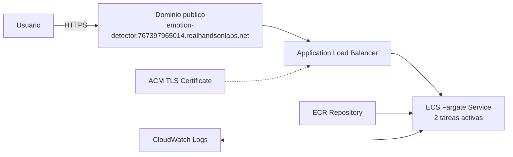
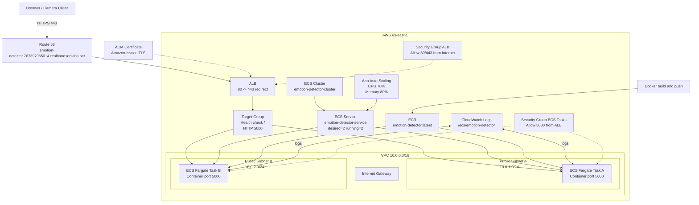
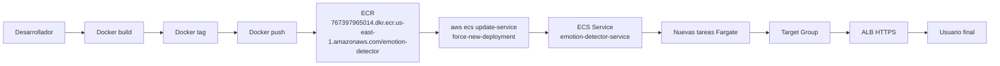

# 🎭 EmotiVision — Detector de Emociones en Tiempo Real

Aplicación web con Flask que usa tu cámara para detectar si una persona está **feliz** o **triste** en tiempo real, usando el modelo de IA **DeepFace**.

---

## 📁 Estructura del Proyecto

```
emotion_detector/
├── app.py                 # Servidor Flask principal
├── requirements.txt       # Dependencias Python
├── README.md
└── templates/
    └── index.html         # UI completa (cámara + visualización)
```

---

## 🚀 Instalación y Uso

### 0. Usar una versión de Python compatible

En Windows, este proyecto debe ejecutarse con **Python 3.10**. El entorno actual con Python 3.14 no es compatible con TensorFlow/DeepFace.

### 1. Instalar dependencias

```bash
py -3.10 -m venv .venv
.venv\Scripts\activate
pip install -r requirements.txt
```

> La primera vez que corras la app, DeepFace descargará automáticamente el modelo de detección de emociones (~100MB). Esto solo ocurre una vez.

### 2. Ejecutar el servidor

```bash
python app.py
```

### 3. Abrir en el navegador

```
http://localhost:5000
```

---

## ⚙️ Cómo Funciona

```
Cámara del navegador
        ↓  (captura frame cada 800ms)
   /analyze_frame  (POST con imagen base64)
        ↓
   DeepFace.analyze()
        ↓  (tensorflow CNN model)
   Probabilidades de 7 emociones
        ↓
   Mapeo a: FELIZ / TRISTE / NEUTRAL
        ↓
   UI en tiempo real (colores, emoji, barras)
```

### Emociones detectadas por DeepFace:
| Emoción raw | Mapeo UI |
|-------------|----------|
| happy       | 😄 Feliz |
| sad         | 😢 Triste |
| angry       | 😢 Triste (parcial) |
| fear        | 😢 Triste (parcial) |
| disgust     | 😢 Triste (parcial) |
| surprise    | 😐 Neutral |
| neutral     | 😐 Neutral |

---

## 🎨 Features de la UI

- **Detección en tiempo real** — análisis cada 800ms
- **Indicador visual dinámico** — borde e iluminación cambian según emoción (amarillo=feliz, azul=triste)
- **Historial visual** — puntos de color muestran las últimas 30 detecciones
- **Desglose de emociones** — barras de porcentaje para las 7 emociones base
- **Indicador de rostro** — avisa cuando no hay cara en el cuadro

---

## 🛠️ Requisitos del Sistema

- Python 3.10 en Windows
- Navegador moderno con acceso a cámara (Chrome, Firefox, Edge)
- Al menos 4GB RAM (TensorFlow)
- Cámara web

---

## 💡 Personalización

Para cambiar la frecuencia de análisis, edita en `index.html`:

```javascript
analysisInterval = setInterval(captureAndAnalyze, 800); // 800ms = ~1.25 análisis/segundo
```

Para usar otro backend de detección facial (más rápido):

```python
# En app.py, cambia detector_backend:
result = DeepFace.analyze(frame, detector_backend="retinaface")  # más preciso
result = DeepFace.analyze(frame, detector_backend="opencv")      # más rápido (default)
result = DeepFace.analyze(frame, detector_backend="ssd")         # balance
```

---

## ☁️ Arquitectura Desplegada en AWS

### URL pública

```text
https://emotion-detector.767397965014.realhandsonlabs.net
```

### 1. Diagrama ejecutivo



### 2. Diagrama técnico



### 3. Componentes principales

- Route 53 publica el dominio de la aplicación.
- ACM emite y administra el certificado TLS.
- El ALB recibe tráfico en 80 y 443, y redirige HTTP hacia HTTPS.
- ECS Fargate ejecuta el contenedor de Flask/DeepFace en alta disponibilidad básica sobre dos subnets públicas.
- ECR almacena la imagen Docker desplegada.
- CloudWatch Logs centraliza los logs de ejecución de los contenedores.
- Application Auto Scaling ajusta la cantidad de tareas según CPU y memoria.

### 4. Vista formal para documentación

La solución se despliega sobre AWS en la región `us-east-1` usando una arquitectura de contenedores administrados. La entrada pública se resuelve mediante Route 53 hacia un Application Load Balancer con terminación TLS administrada por ACM. El balanceador expone la aplicación sobre HTTPS y redirige automáticamente el tráfico HTTP a HTTPS.

La capa de cómputo está implementada con Amazon ECS sobre Fargate, lo que elimina la necesidad de administrar instancias EC2. El servicio `emotion-detector-service` mantiene actualmente `2` tareas en ejecución a partir de la definición `emotion-detector:1`, distribuidas sobre dos subnets públicas dentro de una VPC dedicada. Las imágenes del contenedor se publican en Amazon ECR y los logs de ejecución se centralizan en CloudWatch Logs.

El escalado horizontal se controla mediante Application Auto Scaling con políticas basadas en utilización promedio de CPU y memoria. Esta arquitectura prioriza simplicidad operativa, terminación TLS administrada, despliegue reproducible por Terraform y separación clara entre publicación de imagen, balanceo de tráfico y ejecución de cargas.

### 5. Diagrama de despliegue y actualización



### 6. Costos estimados y responsabilidades

#### Costos orientativos

- `ECS Fargate`: principal costo recurrente, basado en vCPU, memoria y tiempo de ejecución de las tareas.
- `Application Load Balancer`: costo fijo por hora más consumo por tráfico procesado.
- `Route 53`: costo bajo por zona hospedada y consultas DNS.
- `ACM`: sin costo directo para certificados públicos emitidos por Amazon.
- `ECR`: costo por almacenamiento de imágenes.
- `CloudWatch Logs`: costo por ingesta y retención de logs.

#### Responsabilidades operativas

- `Terraform`: aprovisionamiento y cambios de infraestructura.
- `ECR`: almacenamiento y versionado de imágenes Docker.
- `ECS/Fargate`: ejecución del contenedor de aplicación sin gestionar servidores.
- `ALB + ACM`: exposición pública segura, terminación TLS y redirección HTTP a HTTPS.
- `Route 53`: resolución DNS del dominio público.
- `CloudWatch Logs`: observabilidad básica y diagnóstico de ejecución.

#### Riesgos o mejoras futuras

- Mover tareas a subnets privadas con salida controlada para mejorar postura de seguridad.
- Añadir WAF delante del ALB si la aplicación se expone más allá de un entorno de laboratorio.
- Incorporar pipeline automatizado en lugar de despliegue manual con `docker push` y `aws ecs update-service`.
